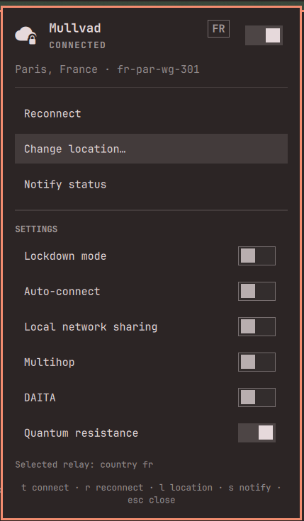

# omarchy-mullvad

Mullvad VPN for [Omarchy](https://omarchy.org): a bar widget with a popup panel,
a full set of menu entries, and the CLI helper both are built on.



## What you get

**In the bar** — the tunnel state at a glance. Bright icon while the tunnel is
up, dimmed while it is down, accent colour while Mullvad is blocking traffic,
and the exit country beside it (`󱇱 FR`).

- **Left click** opens the panel
- **Right click** connects or disconnects
- **Middle click** sends the status as a notification

**In the panel** — the state, the exit relay, and every control: connect,
reconnect, change location, and a live switch for lockdown mode, auto-connect,
local network sharing, multihop, DAITA, and quantum resistance. Keyboard: `j`/`k`
or arrows to move, `enter` to activate, `t` connect, `r` reconnect, `l` location,
`s` notify, `esc` to close.

**In the Omarchy menu** — the same actions, searchable. `Super+Space` then type
`vpn`, or jump straight there:

```bash
omarchy menu summon mullvad
omarchy menu summon mullvad.location
```

Location drills down Country → City → Server, built from a live
`mullvad relay list`.

## Install

The bar widget, as an Omarchy shell plugin:

```bash
omarchy plugin add https://github.com/achevalier-dev/omarchy-mullvad.git --enable
```

Then the menu rows and the CLI helper:

```bash
~/.config/omarchy/plugins/io.github.achevalier-dev.mullvad/install.sh
```

`install.sh` symlinks `bin/mullvad-menu` into `~/.local/bin` and merges the menu
rows into `~/.config/omarchy/extensions/omarchy-menu.jsonc`, backing the file up
first. It is safe to re-run — the block is replaced, never duplicated.

Menu rows and CLI without the bar widget: clone anywhere and run `./install.sh`.

## Requirements

- Omarchy 4.x
- `mullvad` CLI with `mullvad-daemon` running (`mullvad-vpn-daemon-bin`)
- `jq`

## How it works

State comes from a single long-lived `mullvad status -j listen`, which emits one
JSON line per change — the widget never polls.

Every action goes through `bin/mullvad-menu`, which waits for the daemon to
*agree* before it reports. `mullvad connect` returns while the tunnel is still
being built and `mullvad tunnel set …` returns before the value is stored, so
the helper waits for the transition to start, then to finish, and reads settings
back until they match. A switch only moves once the change actually took.

`mullvad-menu` is usable on its own:

```bash
mullvad-menu toggle          # connect or disconnect
mullvad-menu country         # pick a country from a menu
mullvad-menu toggle-lockdown # flip a setting, confirmed with the daemon
```

## Uninstall

```bash
omarchy plugin remove io.github.achevalier-dev.mullvad
rm ~/.local/bin/mullvad-menu
```

Then delete the `// >>> omarchy-mullvad` … `// <<< omarchy-mullvad` block from
`~/.config/omarchy/extensions/omarchy-menu.jsonc`.

## Note on plugins

Omarchy plugins run as unsandboxed code inside the long-lived `omarchy-shell`
process. Read `MullvadPanel.qml` and `bin/mullvad-menu` before enabling — they
are short on purpose.

## License

MIT
